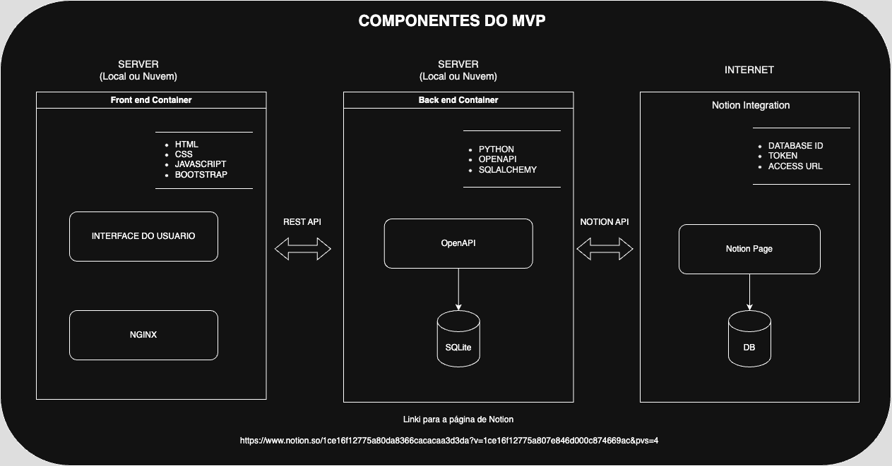

#  Production Automation Tool Back-End

**Aluno: Jaquinei de Oliveira**

Este projeto faz parte do *MVP* do *Sprint 2* da Disciplina **Desenvolvimento Back-End Avançado**.

O objetivo é apresentar o resultado prático obtido após o estudo do conteúdo apresentado ao longo das aulas das disciplinas apresentadas durante este Sprint.

O MVP consiste em um Front-End, um Back-End e o acesso a uma API externa.

Este repositorio faz parte do MVP e contem o código para o Back-End e o código usado para acesso a uma API externa. 

Dentro os cenários apresentados no documento com as instruções sobre os requisitos para o MVP, esse trabalho está enquadrado no *Cenário 1.1*, uma vez que o acesso a API externa está sendo realizado pelo Back-End.

O Back-End disponibilizado neste repositório contem o docker file possibilitando rodar containerizado. 

As instruções para fazer o build da imagem e rodar os container estão na seção [Como iniciar o Back-End usando o docker](#como-iniciar-o-backend-usando-o-docker)

**Este README foca nos detalhes de setup e uso do projeto do Back-End.Para detalhes sobre o projeto do Front-End, acesse o repositório https://github.com/Jaquinei/mvp_2_puc_rio_frontend**

## Diagrama

Arquitetura implementada.



## Back-End (API)

O Back-End foi feito usando Python: Flask como servidor Web e SQLite como banco de dados. O Backend disponibiliza uma API REST que é consumida pelo Front-End. Esta API possibilita que dados disponíveis no Notion sejam disponibilizados para o Front-End. O Acesso aos dados do Notion é feito pelo Back-End através da API diponibilizada pelo Notion. 

O código do Back-End está disponível neste repositorio.

# Executando o projeto

## Como iniciar o Back-End usando o Docker Compose:

- Certifique-se que o Docker e o Docker Compose estejam instalados
- Accesse o diretório do projeto do Front End:
Caso esteja no diretório do Back-End, suba um diretorio:
``` cd .. ```
Acesse o diretório do Front End
``` cd  mvp_2_puc_rio_frontend ```
-  Faça o build das imagens
```
`docker-compose build`
```
- Inicie os containers
```
`docker-compose up `
```
- Acesse a URL http://localhost:5002 no navegador para ter acesso ao SWAGGER.

### Como iniciar o Back-End usando o docker:

- É possivel fazer o build da imagem de cada repositorio individualmente usando apenas docker. Caso tenha interesse, siga os passos a seguir.

- Certifique-se que o Docker esteja instalado

- Crie a imagem

```
docker build -t backend_puc_rio_sprint_2_mvp .
```
- Mapeie a porta local 5002 do host para a porta 5002 do container
```
docker run -e API_EXTERNA_DATABASE_ID=XXXXXXXXXXX -e API_EXTERNA_TOKEN=YYYYYYYYYYYY  -d -p 5002:5002 backend_puc_rio_sprint_2_mvp
```
- Acesse a URL http://localhost:5002 no navegador para ter acesso ao SWAGGER

# Visão geral dos módulos do MVP

## Front-End (Interface)

O Front-End foi desenvolvido usando *HTML*, *CSS* e *JavaScript* e *Bootstrap*. Pode ser usado independentemente do Back-End, mas para persistir os dados é necessário que o Back-End esteja rodando.

O código do Front-End está disponível em outro repositório. Para detalhes sobre o projeto do Front-End, acesse o repositório https://github.com/Jaquinei/mvp_2_puc_rio_frontend

## Back-End (API)

A REST API é disponibilizada pelo Back-End e apresenta as seguintes rotas:

    GET /
Redireciona para o Swagger

    GET /docs
Swagger - Redireciona para o endpoint do Swagger, que permite visualizar a documentação da API em diferentes formatos.

    GET /tasks
Retorna a lista de tasks presentes no banco de dados do back-end.

    GET /notion-data
Acessa dados de uma API externa do Notion.
Requisitos: DATABASE_ID e TOKEN devem ser fornecidos.

    DELETE /task?name={task_name}
Remove uma task utilizando o nome da task como parâmetro de query (name).

    GET /task?task_id={id}
Obtem os dados de uma task específica, usando o identificador task_id como parametro

    PUT /task/{task_id}
Atualiza os dados de uma task usando o identificador task_id como parametro da roda.
No Body da requisição é esperado objeto JSON com os campos a serem atualizados.

    POST /task{name, priority,product, start_date, task_type, end_date}
cadastra uma task

    POST /comment{task_id, text}
Cadastra um comentário associado a uma task. No Body da requisição é esperado o identificador da task (task_id) e o comentário em formato string.


## Acesso a uma API externa

O acesso a API externa está sendo feito utilizando a API da Notion (https://developers.notion.com/)
Para o Back-End acessar a API é necessário utilizar as seguintes informações:
- Notion API URL
- Token Notion
- Database ID

Estas informações (Notion API URL, Token e Database ID) serão disponibilizadas no texto de submissão deste MVP.

Foi criada um Notion page com uma lista de Tasks. Essas tasks podem ser incluidas no Prodution Automation Tool. Para acessar a lista do Notion, diretamente, o seguinte link pode ser usado (https://www.notion.so/1ce16f12775a80da8366cacacaa3d3da?v=1ce16f12775a807e846d000c874669ac&pvs=4).


# Development environment 

## Como executar o Back-End

### Dev
Será necessário ter instaladas todas as bibliotecas Python listadas no arquivo `requirements.txt`.

Após clonar o repositório, é necessário ir ao diretório raiz, pelo terminal, para poder executar os comandos descritos abaixo.

> É fortemente indicado o uso de ambientes virtuais do tipo [virtualenv](https://virtualenv.pypa.io/en/latest/installation.html).

Crie o *virtual environment
```
python -m venv env
```
Ative o *virtual environment*

Windows:
```
.\env\Scripts\Activate
```
macOS:
```
source env/bin/activate
```

Installe todas as dependencias necessárias para rodar o projeto
```
(env)$ pip install -r requirements.txt
```
> Este comando instala as dependências/bibliotecas, descritas no arquivo `requirements.txt`.

Para executar o Back-End que expõe a API:

```
(env)$ flask run --host 0.0.0.0 --port 5002
```
> A porta **5002** está hardcode no projeto do Front-End.
> Caso queira alterar a porta, ajuste a variável *SERVER_URL* no arquivo *scripts.js* do projeto do Front-End.

Abra o link [http://localhost:5002](http://localhost:5002/) no navegador para verificar o status da API em execução.

External API access

Para acessar o database do Notion, é possível usar o seguinte comando:

```
curl -X POST \
'https://api.notion.com/v1/databases/<database>/query' \
-H 'Authorization: Bearer <token>' \
-H 'Notion-Version: 2021-05-13' \
-H 'Content-Type: application/json'
```

### Docker

- Certifique-se que o Docker esteja instalado
- Cria a imagem
```
docker build -t backend_puc_rio_sprint_2_mvp .
```
- Mapeia a porta local 5002 do host para a porta 5002 do container
```
docker run -d -p 5002:5002 backend_puc_rio_sprint_2_mvp
```
- Acesse a URL http://localhost:5002 no navegador para ter acesso ao SWAGGER